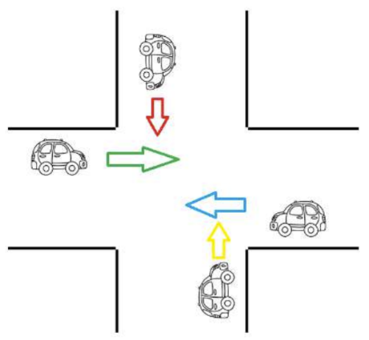

# -SO-Lista12-Semaforos
Exercícios propostos na Lista Semáforos Python 1

<strong>1.</strong> Fazer uma aplicação, console, que gerencie a figura abaixo:

Para tal, usar uma variável sentido, que será alterado pela Thread que controla cada carro com a movimentação do carro. Quando a Thread tiver a possibilidade de ser executada, ela deve imprimir em console o sentido que o carro está passando. Só pode passar um carro por vez no cruzamento.

<strong>2.</strong> Quatro pessoas caminham, cada uma em um corredor diferente. Os 4 corredores terminam em uma única porta. Apenas 1 pessoa pode cruzar a porta, por vez. Considere que cada corredor tem 200m. e cada pessoa anda de 4 a 6 m/s. Cada pessoa leva de 1 a 2 segundos para abrir e cruzar a porta. Faça uma aplicação que simule essa situação.

<strong>3.</strong> Fazer uma aplicação de uma corrida de sapos, com 5 Threads, cada Thread controlando 1 sapo. Deve haver um tamanho máximo para cada pulo do sapo (em centímetros) e a distância máxima para que os sapos percorram. A cada salto, um sapo pode dar um salto de 0 até o tamanho máximo do salto (valor aleatório entre 1 e 5 cm.). Após dar um salto, a Thread, para cada sapo, deve mostrar no console, qual foi o tamanho do salto e quanto o sapo percorreu. Assim que o sapo percorrer a distância máxima, <strong>a Thread deve apresentar a posição que o sapo chegou.</strong>

<strong>4.</strong> Você foi contratado para automatizar um treino de Fórmula 1. As regras estabelecidas pela direção da prova são simples:

“No máximo 5 carros da 7 escuderias[equipes] (Cada escuderia tem 2 carros diferentes, portanto, 14 carros no total) presentes podem entrar na pista simultaneamente, mas apenas um carro de cada equipe. O segundo carro deve ficar à espera, caso um companheiro de equipe já esteja na pista. Cada piloto deve dar 3 voltas na pista. O tempo de cada volta deverá ser exibido.

